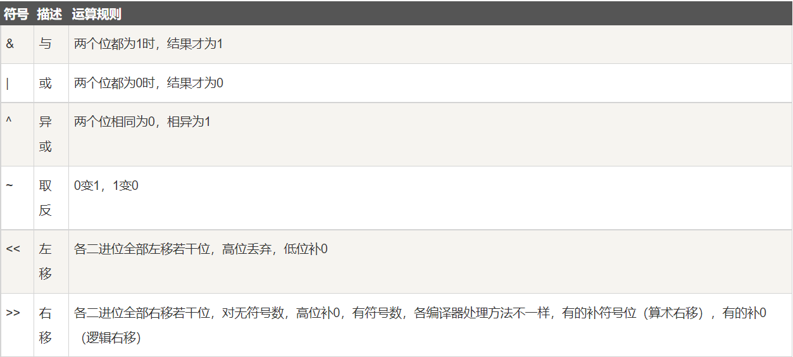

[TOC]

# Algorithms 算法通关之路

## 1 剑指offer（专项突破版）
### 1 整数 [文档](sword-for-offer/ch1_integer/README.md)

#### 1.1 整数的基础知识

1. Java中有4种不同的整数类型，分别为8位的byte($ -2^{7} \sim 2^{7}-1$ ）、16位的short$ -2^{15} \sim 2^{15}-1$ ）、32位的int$ -2^{32} \sim 2^{32}-1$ ）和64位的long（$ -2^{63} \sim 2^{63}-1$ ）。
2. 无符号整数无论二进制表示的最高位是0还是1，都表示其为一个正数。无符号的32位整数的范围是0～232-1。

#### 1.2 二进制

1. 二进制的位运算

   1. 非`~`、与`&`、或`|`、异或`^`、左移`<<`、右移`>>` 
   2. 特例：Java中增加了一种无符号右移位操作符`>>>`。无论是对正数还是负数进行无符号右移操作，都将在最左边插入0。

   

2. 例子一：

   > 计算整数i的二进制形式中1的个数有多种不同的方法，其中一种比较高效的方法是每次用“i&（i-1）”将整数i的最右边的1变成0。整数i减去1，那么它最右边的1变成0。如果它的右边还有0，则右边所有的0都变成1，而其左边所有位都保持不变。下面对i和i-1进行位与运算，相当于将其最右边的1变成0。以二进制的1100为例，它减去1的结果是1011。1100和1011的位与运算的结果正好是1000。二进制的1100最右边的1变为0，结果刚好就是1000。

3. 例子二：

   > 如果正整数i是一个偶数，那么i相当于将“i/2”左移一位的结果，因此偶数i和“i/2”的二进制形式中1的个数是相同的。如果i是奇数，那么i相当于将“i/2”左移一位之后再将最右边一位设为1的结果，因此奇数i的二进制形式中1的个数比“i/2”的1的个数多1。例如，整数3的二进制形式是11，有2个1。偶数6的二进制形式是110，有2个1。奇数7的二进制形式是111，有3个1。我们可以根据3的二进制形式中1的个数直接求出6和7的二进制形式中1的个数。
   >
   > `i >> 1` 计算` i / 2`
   >
   > `i & 1` 计算`i % 2`

4. 例子三

   > 任何一个数字异或它自己的结果都是0。
   >
   > `(num>>(31-i))&1` 用来得到整数num的二进制形式中从左数起第i个数位。整数i先被右移31-i位，原来从左数起第i个数位右移之后位于最右边。接下来与1做位与运算。整数1除了最右边一位是1，其余数位都是0，它与任何一个数字做位与运算的结果都是保留数字的最右边一位，其他数位都被清零。如果整数num从左数起第i个数位是1，那么`(num>>(31-i))&1` 的最终结果就是1；否则最终结果为0。

#### 1.3 本章小结

1. 编程语言（如Java）可能定义了多种占据不同内存空间的整数类型，内存空间不同的整数类型的值的范围也不相同。
2. 整数在计算机中使用二进制形式表示，每位不是0就是1。位运算是对二进制整数的运算，包括与运算、或运算、非运算、异或运算、左移运算和右移运算。只有深刻理解每种位运算的特点才能在需要的时候灵活地应用合适的位运算解决相应的问题。

### 2 数组 [文档](sword-for-offer/ch2_array/README.md)

#### 2.2 双指针

1.  双指针（不是C语言中的指针）是一种常用的解题思路，可以使用两个相反方向或相同方向的指针扫描数组从而达到解题目的。它是一个相对宽泛的概念，是能定位数据容器中某个数据的手段。在数组中它实际上是数字的下标。
2. 方向相反的双指针经常用来求排序数组中的两个数字之和。一个指针P1指向数组的第1个数字，另一个指针P2指向数组的最后一个数字，然后比较两个指针指向的数字之和及一个目标值。如果两个指针指向的数字之和大于目标值，则向左移动指针P2；如果两个指针指向的数字之和小于目标值，则向右移动指针P1。此时两个指针的移动方向是相反的。
3. 方向相同的双指针通常用来求正数数组中子数组的和或乘积。初始化的时候两个指针P1和P2都指向数组的第1个数字。如果两个指针之间的子数组的和或乘积大于目标值，则向右移动指针P1删除子数组最左边的数字；如果两个指针之间的子数组的和或乘积小于目标值，则向右移动指针P2在子数组的右边增加新的数字。此时两个指针的移动方向是相同的。

#### 2.3 累加数组数字求子数组之和

1. 使用双指针解决子数组之和的面试题有一个前提条件——数组中的所有数字都是正数。如果数组中的数字有正数、负数和零，那么双指针的思路并不适用，这是因为当数组中有负数时在子数组中添加数字不一定能增加子数组之和，从子数组中删除数字也不一定能减少子数组之和
2. 换一种思路求子数组之和。**累加数组数字**：假设整个数组的长度为n，它的某个子数组的第1个数字的下标是i，最后一个数字的下标是j。为了计算子数组之和，需要先做预处理，计算从数组下标为0的数字开始到以每个数字为结尾的子数组之和。预处理只需要从头到尾扫描一次，就能求出从下标0开始到下标0结束的子数组之和S0，从下标0开始到下标1结束的子数组之和S1，以此类推，直到求出从下标0开始到最后一个数字的子数组之和Sn-1。因此，从下标为i开始到下标为j结束的子数组的和就是Sj-Si-1。

#### 2.4 本章小结

1. 双指针是解决与数组相关的面试题的一种常用技术。如果数组是排序的，那么应用双指针技术就能够用O（n）的时间在数组中找出两个和为给定值的数字。如果数组中的所有数字都是整数，那么应用双指针技术就可以用O（1）的辅助空间找出和为给定值的子数组。
2. 如果关于子数组的数字之和的面试题并没有限定数组中的所有数字都是正数，那么可以尝试从第1个数字开始累加数组中前面若干数字之和，两个累加的和的差值对应一个子数组的数字之和。这种累加数组中前面若干数字之和的思路，不仅适用于一维数组，还适用于二维数组

## 2 算法，第四版

